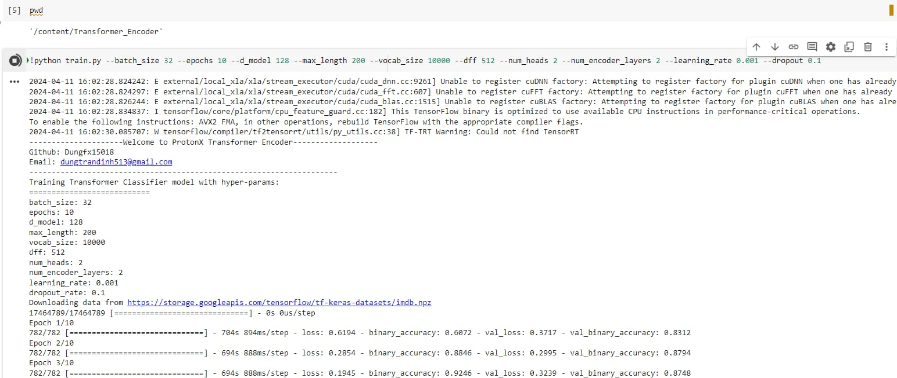

# Transformer Encoder Classifier 


<p align="center">
    
</p>

Description about your project. Why do you choose to build this?  <--- **FIXME**

Slide about your project (if it's available) <--- **FIXME**

Architecture Image <--- **FIXME**


##  Set up environment
- Step 1: 

```python
create requirements.txt
```

- Step 2: 
```
pip install -r requirements.txt
```


##  Set up your dataset

- Guide user how to download your data and set the data pipeline:
```
https://storage.googleapis.com/tensorflow/tf-keras-datasets/imdb.npz
```

##  Training Process
There are some important arguments for the script you should consider when running it:

- `batch-size`
- `max-length`
- `vocab-size`
- `d-model`:[page 5](https://arxiv.org/pdf/1706.03762.pdf)
- `num-encoder_layers`
- `num-heads`
- `dff`

- `dropout-rate`


Training script:


```python

!python train.py --batch_size 32 --epochs 10 --d_model 128 --max_length 200 --vocab_size 10000 --dff 512 --num_heads 2 --num_encoder_layers 2 --learning_rate 0.001 --dropout 0.1
``` 


## Result and Comparision


Your implementation
```
Epoch 6/10
782/782 ━━━━━━━━━━━━━━━━━━━━ 240s 306ms/step - BinaryAccuracy: 0.9835 - loss: 0.0528 - val_BinaryAccuracy: 0.8472 - val_loss: 0.6105
Epoch 7/10
782/782 ━━━━━━━━━━━━━━━━━━━━ 234s 300ms/step - BinaryAccuracy: 0.9903 - loss: 0.0313 - val_BinaryAccuracy: 0.8439 - val_loss: 0.7300
Epoch 8/10
782/782 ━━━━━━━━━━━━━━━━━━━━ 236s 302ms/step - BinaryAccuracy: 0.9928 - loss: 0.0223 - val_BinaryAccuracy: 0.8412 - val_loss: 0.7693
Epoch 9/10
782/782 ━━━━━━━━━━━━━━━━━━━━ 235s 301ms/step - BinaryAccuracy: 0.9942 - loss: 0.0177 - val_BinaryAccuracy: 0.8349 - val_loss: 0.9049
Epoch 10/10
782/782 ━━━━━━━━━━━━━━━━━━━━ 236s 302ms/step - BinaryAccuracy: 0.9956 - loss: 0.0143 - val_BinaryAccuracy: 0.8377 - val_loss: 0.9590
782/782 ━━━━━━━━━━━━━━━━━━━━ 57s 72ms/step - BinaryAccuracy: 0.8390 - loss: 0.9482
Test Loss: 0.9589828848838806, Test_Accuracy: 0.8377199769020081


```
## Run Project



## Authors:
- Github: https://github.com/Dungfx15018
- Email: dungtrandinh513@gmail.com

## Advisors:
- Github: https://github.com/bangoc123
- Email: protonxai@gmail.com

